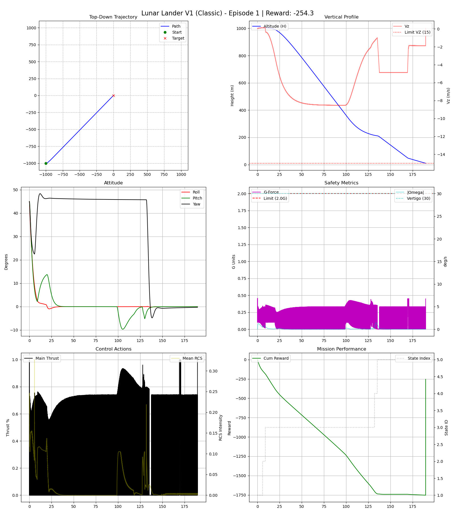
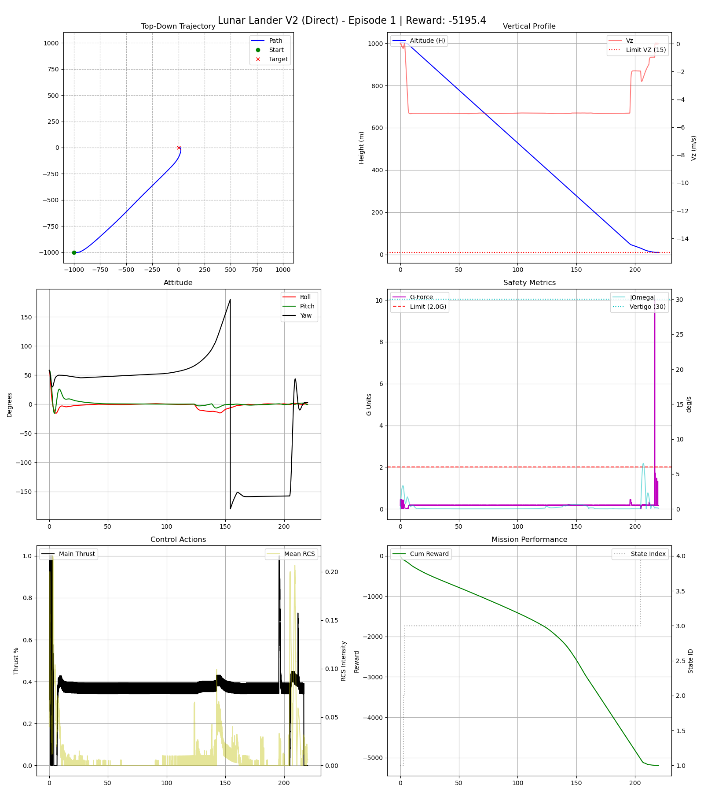
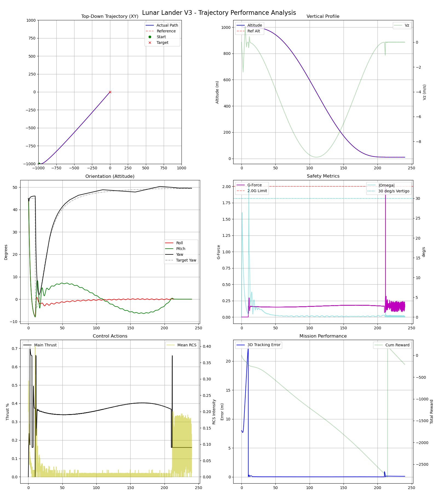

# LunarLander3D

LunarLander3D is a custom, high-fidelity 3D Reinforcement Learning environment built on top of [Gymnasium](https://gymnasium.farama.org/) and simulated using [PyBullet](https://pybullet.org/). It extends the classic 2D Lunar Lander into a fully 3D world with 6 Degrees of Freedom (6-DoF), realistic rigid-body physics, and complex control challenges.

## 🚀 Features
- **Full 3D Physics:** 6-DoF rigid body dynamics with gravity ($g = -1.62 \, m/s^2$).
- **Realistic Actuators:** Main thruster for vertical lift and RCS (Reaction Control System) thrusters for pitch, roll, yaw, and lateral translations.
- **Multiple Control Baselines:** Includes three distinct conventional control strategies (V1, V2, V3) ranging from classical PID to advanced rigid-body trajectory tracking.
- **Live Telemetry Dashboard:** Real-time Matplotlib dashboard with OSC telemetry for monitoring altitude, attitude, velocity, G-force, and more.
- **Smart Launcher:** Automatic window positioning with `xdotool` for clean side-by-side execution.

## 📁 Project Structure
```
LunarLander3D/
├── README.md                   # This file
├── requirements.txt            # Python dependencies
├── .gitignore
├── launch_mission.sh           # Smart launcher (with optional dashboard)
├── live_dashboard.py           # Real-time telemetry dashboard (OSC)
├── osc_sender.py               # OSC telemetry sender module
├── trajectory_planner.py       # Quintic polynomial trajectory planner (V3)
├── mission_v1_classic.py       # Mission V1: Classic Decoupled PID
├── mission_v2_direct.py        # Mission V2: Direct Thrust Vectoring
├── mission_v3_trajectory.py    # Mission V3: Trajectory Tracking
├── lunar_lander_3d/            # Gymnasium environment package
│   ├── __init__.py
│   └── envs/
│       ├── __init__.py
│       ├── lunar_lander_env.py # Core environment (34D obs, 21D action)
│       └── assets/
│           ├── lunar_lander.urdf
│           └── meshes/         # 3D mesh files (.dae)
└── reports/                    # Auto-generated mission report charts
```

## 🛠️ Installation

Clone the repository and install the required dependencies:

```bash
git clone https://github.com/fitranurmayadi/LunarLander3d.git
cd LunarLander3d
pip install -r requirements.txt
```

> **Note:** It is highly recommended to use a virtual environment (e.g., `python -m venv venv`).

### Optional: Window Positioning (Linux/X11)
For automatic window layout (dashboard + PyBullet side-by-side), install `xdotool`:
```bash
sudo apt install xdotool
```

---

## 🎮 Usage & Mission Testing

### Running a Single Mission Directly
```bash
python mission_v1_classic.py       # V1: Classic Decoupled PID
python mission_v2_direct.py        # V2: Direct Thrust Vectoring
python mission_v3_trajectory.py    # V3: Trajectory Tracking
```

### Using the Smart Launcher (with Live Dashboard)
The `launch_mission.sh` script starts the live dashboard alongside the mission and automatically positions windows side-by-side:

```bash
# With live dashboard (default)
./launch_mission.sh v1
./launch_mission.sh v2
./launch_mission.sh v3

# Without live dashboard
./launch_mission.sh v1 --no-dashboard
./launch_mission.sh v2 --no-dashboard
./launch_mission.sh v3 --no-dashboard
```

---

## 📋 Shared Command-Line Arguments
All mission scripts (`mission_v1_classic.py`, `mission_v2_direct.py`, `mission_v3_trajectory.py`) share the same standardized arguments:

| Argument | Description | Example |
|----------|-------------|---------|
| `--episodes N` | Run N consecutive episodes (default: 1) | `--episodes 3` |
| `--fixed` | Compass Test: Spawn in 4 quadrants (SW, NW, SE, NE) at 1km with 45° tilt | `--fixed` |
| `--spawn X Y Z` | Custom spawn position (meters) | `--spawn -1000 -1000 1000` |
| `--orient R P Y` | Custom initial orientation in degrees (Roll, Pitch, Yaw) | `--orient 45 45 45` |
| `--no-render` | Run headless without PyBullet GUI (fast testing) | `--no-render` |
| `--no-dashboard` | Disable live OSC telemetry to dashboard | `--no-dashboard` |

---

## 🧪 Usage Examples

### 1. Random Spawn (Default)
The lander spawns at a random position within ±900m horizontally, at 1000m altitude, with random orientation:
```bash
python mission_v1_classic.py
python mission_v2_direct.py
python mission_v3_trajectory.py
```

### 2. Default Fixed Spawn (Compass Test)
Runs 4 episodes from fixed quadrants (SW, NW, SE, NE) at 1km altitude with 45° tilt on all axes:
```bash
python mission_v1_classic.py --fixed
python mission_v2_direct.py --fixed
python mission_v3_trajectory.py --fixed
```

### 3. Custom Spawn Position & Orientation
```bash
# Spawn at (-1000, -1000, 1000) with 45° roll, pitch, yaw
python mission_v1_classic.py --spawn -1000 -1000 1000 --orient 45 45 45

# Spawn at (500, -500, 800) with no initial tilt
python mission_v2_direct.py --spawn 500 -500 800

# Spawn at (0, 0, 500) straight down — short landing test
python mission_v3_trajectory.py --spawn 0 0 500 --orient 0 0 0
```

### 4. With Live Dashboard (via Launcher)
```bash
# V1 with dashboard, custom spawn
./launch_mission.sh v1 --spawn -1000 -1000 1000 --orient 45 45 45

# V2 with dashboard, random spawn
./launch_mission.sh v2

# V3 without dashboard, compass test
./launch_mission.sh v3 --no-dashboard --fixed
```

### 5. Multiple Episodes
```bash
# Run 5 random episodes of V1
python mission_v1_classic.py --episodes 5

# Run 3 random episodes of V2 headless (no GUI)
python mission_v2_direct.py --episodes 3 --no-render
```

---

## 📊 Live Telemetry Dashboard

The dashboard provides real-time visualization of 6 telemetry panels:

| Panel | Metrics |
|-------|---------|
| **Altitude & Vertical Speed** | Height (m), Vz (m/s) |
| **Attitude** | Roll, Pitch, Yaw (degrees) |
| **Horizontal Velocity** | Vx, Vy (m/s) |
| **Safety Metrics** | G-Force, Distance to target (m) |
| **Control Actions** | Main Thrust %, Mean RCS intensity |
| **Mission Performance** | Cumulative reward, State ID |

### Running the Dashboard Standalone
```bash
# With OSC server (waiting for mission data)
python live_dashboard.py

# Without OSC server (empty display for testing)
python live_dashboard.py --no-osc
```

### Output Reports
After each episode finishes, a comprehensive performance chart is automatically generated and saved in the `reports/` folder as PNG images.

---

## 🧠 Theory and Control Techniques

### Mission V1: Classic Decoupled PID
**Concept:**
This controller uses a Finite State Machine (FSM) combined with decoupled PID controllers. It separates horizontal movement from vertical movement. To move laterally, it calculates the required horizontal velocity, feeds it into a PID loop, and translates the output into a **Target Pitch/Roll angle**.

**Pros:**
- Highly stable and easy to tune.
- "Safe" flight envelope; the lander always prefers leveling out before descending.

**Cons:**
- Inefficient and slow trajectory.
- Stops at invisible "waypoints" before proceeding to the next state, causing a robotic, step-by-step flight path.

**V1 Test (spawn=-1000 -1000 1000, orient=45 45 45; no-dashboard/no-render):**




### Mission V2: Direct Vectoring
**Concept:**
Unlike V1, V2 blends transit and landing phases. It uses **Direct Thrust Vectoring** where the horizontal error is mapped directly to a tilted thrust vector. The controller continuously updates its orientation to point the thrust vector opposite to the velocity vector while simultaneously aiming for the landing pad.

**Pros:**
- Smooth, continuous, and cinematic flight path.
- Much faster transit time compared to V1.

**Cons:**
- Strongly coupled dynamics (pitching to move laterally inherently reduces vertical lift).
- Difficult to tune the safety envelope to prevent the lander from tumbling at high speeds.

**V2 Test (spawn=-1000 -1000 1000, orient=45 45 45; no-dashboard/no-render):**




### Mission V3: High-Precision Trajectory Mastery
**Concept:**
This is the most advanced controller. It abandons simple error-based PID in favor of **Rigid-Body Dynamics Tracking**. 
1. It pre-calculates a smooth 3D mathematical curve (e.g., using polynomial splines) from the start position to the target.
2. It calculates the exact **Reference Position, Velocity, and Acceleration** at every millisecond $t$.
3. It converts the reference acceleration vector directly into a required Body Frame orientation matrix using Feed-Forward terms.

**Pros:**
- Extremely precise (centimeter-level accuracy).
- Obeys kinematic constraints perfectly (no sudden jerks).

**Cons:**
- Computationally heavy.
- Very sensitive to simulation step-size variations ($dt$). If PyBullet stutters, the trajectory tracking error diverges rapidly.

**V3 Test (spawn=-1000 -1000 1000, orient=45 45 45; no-dashboard/no-render):**




---

## 🛰️ Vehicle & Environment (Physical Model)

### Vehicle (Lander) — size, mass, and actuators
The lander is based on **Apollo/Lunar Lander**, but simplified (especially geometry/rig details and mechanisms) to remain stable for RL control—more like “LEGO parts” (clean, modular). It uses **Apollo 4× scaling**, consistent with the scale applied in the mesh/URDF assets.

**Main scale / dimensions (from comments & URDF):**
- Main body: mesh scale **4×**.
- URDF comments indicate a **~4 m diameter** and **~4 m height** in the already-scaled (Apollo-scaled) version.

**Mass (URDF link mass summation):**
- Main body: **3500 kg**
- Main thruster: **500 kg**
- RCS (4 clusters): **100 kg each** → total **400 kg**
- 4 legs: **150 kg each** → total **600 kg**
- 4 foot sensors: **0.01 kg each** → total **0.04 kg**
- **Total mass (approx.):** **~5100.04 kg**

**Thrusters / control capabilities (per environment code):**
- **Main thruster**
  - 1 actuator, max force: **22,000 N**
  - Thrust direction: **+Z axis** in the body frame
  - Nozzle position (local): **(0, 0, -6.0) m** (nozzle exit ~6 m below the body center in the model)
- **RCS (Reaction Control System)**
  - 20 actuators (4 groups × 5 nozzles)
  - Max force per nozzle: **5,000 N** (uses `rcs_thruster_force_scale = 5000`)
  - Cluster origins (local) in the body frame:
    - front: **(+2.8, 0, 2.4)**
    - back: **(-2.8, 0, 2.4)**
    - left: **(0, +2.8, 2.4)**
    - right: **(0, -2.8, 2.4)**
  - Nozzle strategy applies forces along **±X / ±Y / ±Z** to control lateral translation and attitude torque.

### Environment — planets, gravity, wind, and terrain
The environment simulates **vacuum (no damping)** conditions, but still adds external disturbances to make episodes more realistic and challenging.

**Planet modes (parameters from the env):**
| Planet | Gravity (m/s²) | Drag | Wind (optional) |
|---|---:|---:|---|
| **Earth** | -9.8 | `drag_coeff` (default 0.5) | default `wind_force=15`, `wind_freq=0.1` |
| **Moon** (default) | -1.62 | 0.0 (drag off) | wind disabled (`0.0`) |
| **Mars** | -3.711 | 0.3 | `wind_force=10`, `wind_freq=0.1` |

**Terrain (procedural heightfield):**
- Grid: **256 × 256**
- Area size: uses `mesh_scale=[5,5,1]`
  - XY sampling distance = **5 m**
  - Total area ≈ **1.28 km × 1.28 km**
- Height shaping:
  - `height_scale = 5.0` (hill amplitude)
  - height formed from sine/cos combinations + micro-roughness
- **Flat landing pad**:
  - flat zone based on radius from center: **r ≤ 30 m** (blend 0 inside)
  - visual landing pad: **radius 2.5 m** (diameter 5 m)

**Physics / timestep**
- PyBullet: **100 Hz** (`render_fps = 100` → `setTimeStep(1/100)`)
- No linear/angular/joint damping (vacuum): `linearDamping=0`, `angularDamping=0`, `jointDamping=0`

---

## 🌍 Environment Specifications


| Property | Value |
|----------|-------|
| **Observation Space** | 34-dim continuous (previous 17 + current 17) |
| **Action Space** | 21-dim continuous [0, 1] |
| **Main Thruster** | 1 actuator (22,000 N max) |
| **RCS Thrusters** | 20 actuators (4 groups × 5 nozzles, 5,000 N each) |
| **Planet Modes** | Earth, Moon (default), Mars |
| **Terrain** | Procedural heightfield (1.28km × 1.28km) with flat landing pad |
| **Physics Engine** | PyBullet (100 Hz simulation) |

## 📄 License
This project is for educational and research purposes.

